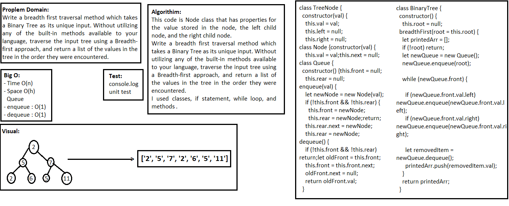

## Breadth First
> This code is Node class that has properties for the value stored in the node, the left child node, and the right child node.

### Challenge
Write a breadth first traversal method which takes a Binary Tree as its unique input. Without utilizing any of the built-in methods available to your language, traverse the input tree using a Breadth-first approach, and return a list of the values in the tree in the order they were encountered.

### Approach & Efficiency
- I used classes, if statement, while loop, and methods.

### Big O:

> `- Time O(n)`

> `- Space O(h)`

**Queue**
> - enqueue : O(1)

> - dequeue : O(1)

**Binary Tree -** (breadthFirst):
- Time O(n) n is the number of nodes
- Space O(h) h is the height of the tree

### Solution

