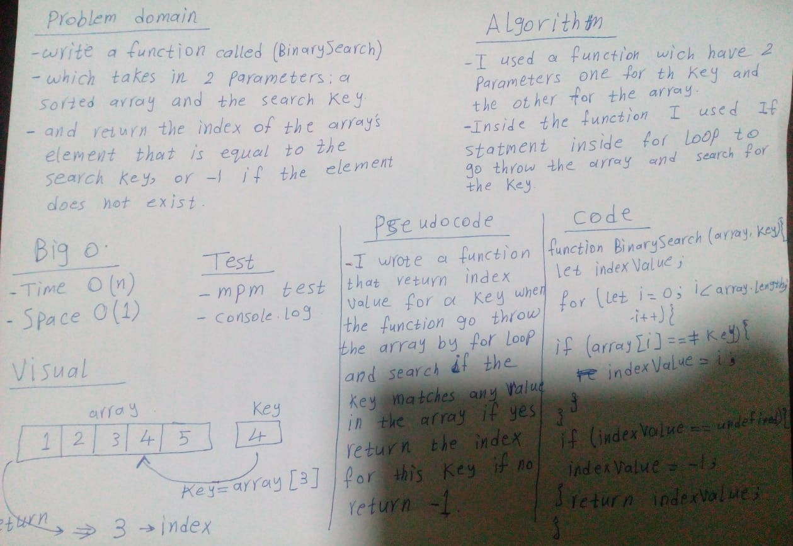

### Binary Search
> This code is return the index for the value if the balue exist in the array, if not the function will return -1.

### Challenge
It is a function called BinarySearch which takes in 2 parameters: a sorted array and the search key. and return the index of the array’s element that is equal to the search key, or -1 if the element does not exist.

### Approach & Efficiency
- I used a function which return value (index).
- Inside the function I used foor loop and if statement to return the right index or -1;

### Big O: 
- Time O(n) Space O(1).

### Unit Tests
def array-binary-search(array,key):
    expected = [1,2,3,4,5]
    actual = insertShiftArray([1,2,3,4,5],3)
    assert expected is actual, "BinarySearch of [1,2,3,4,5] and 3 should be 2"

### Solution
