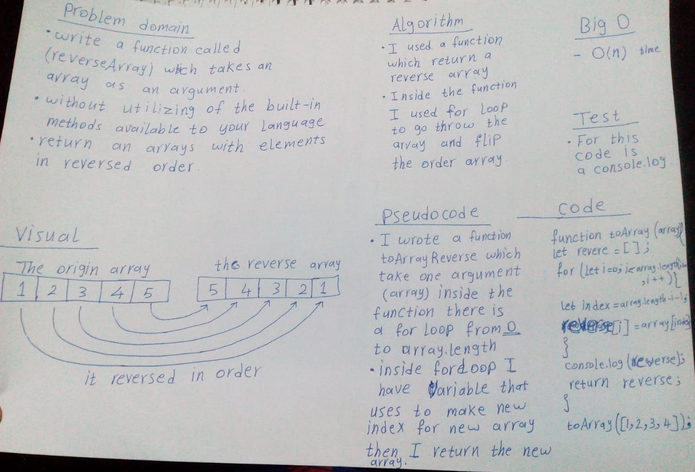

# Reverse an Array
- This code is return the reverse array from the origin array.

## Challenge
It is a function called `reverseArray` which take an array as an argument, should solved without utilizing of the build-in method, and this fynction return an array with elements in reversed order.

## Approach & Efficiency
- I used a function which return a reverse array.
- Inside the function I used for loop to go throw the array and flip the order array.
- Big O `time O(n)`

## Solution
