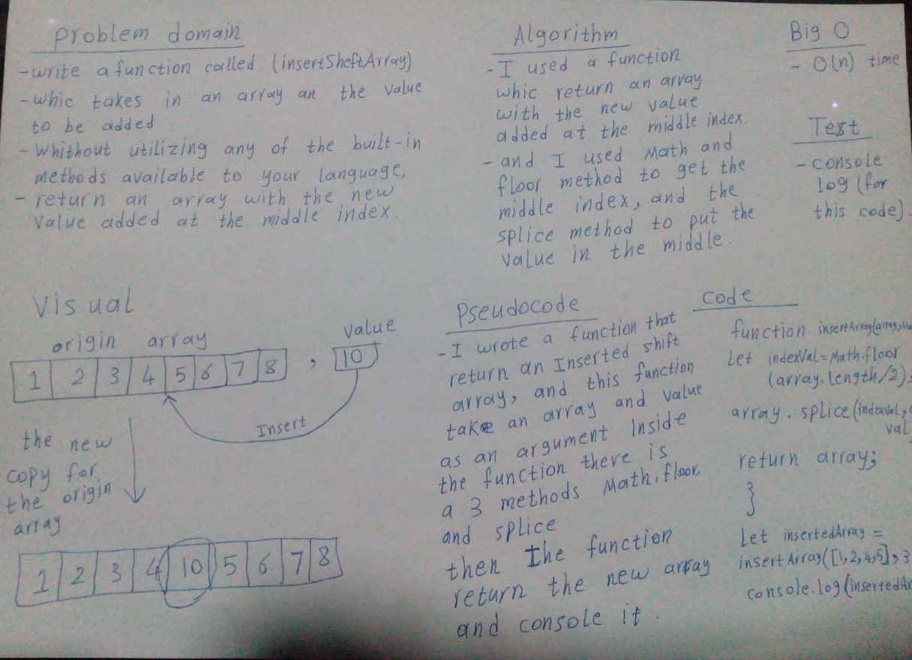

### Sheft Array
> This code is return the array with inserted value in the middle index.

### Challenge
It is a function called insertShiftArray which takes in an array and the value to be added (as an argument), then return an array with the new value added at the middle index.

### Approach & Efficiency
- I used a function which return an array with the new value added at the middle index.
- Inside the function I used Math and floor method to get the middle index, and splice method to put the value in the middle.

### Big O time O(n)

### Unit Tests
def test_should_insert_sheft_array(array,value):
    expected = [1,2,3,4,5]
    actual = insertShiftArray([1,2,4,5],3)
    assert expected is actual, "insertShiftArray of [1,2,4,5] and 3 should be [1,2,3,4,5]"

### Solution
