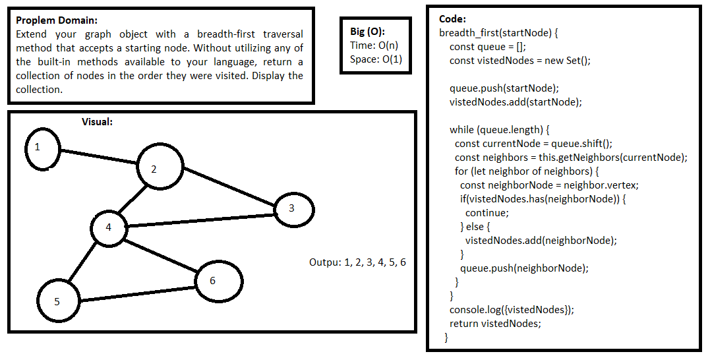

## Graph

### Challenge
- Extend your graph object with a breadth-first traversal method that accepts a starting node. Without utilizing any of the built-in methods available to your language, return a collection of nodes in the order they were visited. Display the collection.

### Approach & Efficiency
- I used function, for loop, if statements, and while loop.

### API
- 

### Big O:
**In General:**
Time: O(n), Space: O(1)

**breadth_first** 
 > Time O(n^2) because it have for loop inside while loop.
 > Space O(n) because there is no additional memory.

### Solution
