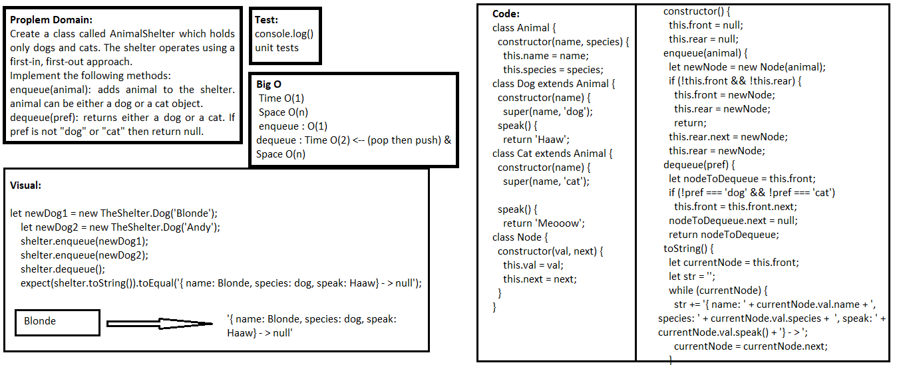

## Fifo Animal Shelter
> This code is holds only dogs and cats. The shelter operates using a first-in, first-out approach.

### Challenge
Create a class called AnimalShelter which holds only dogs and cats. The shelter operates using a first-in, first-out approach.
Implement the following methods:
enqueue(animal): adds animal to the shelter. animal can be either a dog or a cat object.
dequeue(pref): returns either a dog or a cat. If pref is not "dog" or "cat" then return null.

### Approach & Efficiency
- I used classes, if statement, while loop, and methods.

### API  
**enqueue()**
- which takes any value as an argument and adds a new node with that value to the back of the queue with an O(1) Time performance.

**dequeue()**
- that does not take any argument, and travers thru the queue and checks the val is a dog or a cat.

### Big O:

> `- Time O(1)`

> `- Space O(n)`

> - enqueue : O(1)

> - dequeue : Time O(2) <-- (pop then push) & Space O(n)

### Solution

