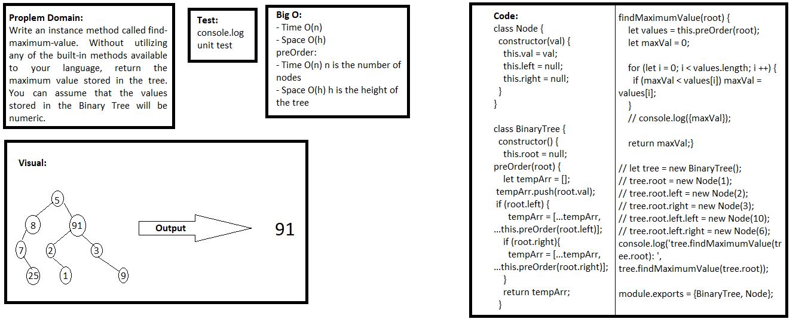

## Finding Maximum Value
> This code is Node class that has properties for the value stored in the node, the left child node, and the right child node.

### Challenge
Write an instance method called find-maximum-value. Without utilizing any of the built-in methods available to your language, return the maximum value stored in the tree. You can assume that the values stored in the Binary Tree will be numeric.

### Approach & Efficiency
- I used classes, if statement, and methods.

### API  
- preOrder: which returns an array of the values, ordered appropriately.
- findMaximumValue: which return the maximum value stored in the tree. You can assume that the values stored in the Binary Tree will be numeric.
### Big O:

> `- Time O(n)`

> `- Space O(h)`

**preOrder:**
- Time O(n) n is the number of nodes
- Space O(h) h is the height of the tree

**preOrder:**
- O(log(n))
- O(1)

### Solution

