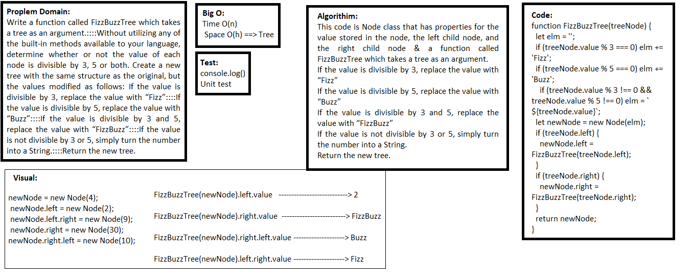

## FizzBuzz
> This code is Node class that has properties for the value stored in the node, the left child node, and the right child node & a function called FizzBuzzTree which takes a tree as an argument.

### Challenge
Write a function called FizzBuzzTree which takes a tree as an argument.
Without utilizing any of the built-in methods available to your language, determine whether or not the value of each node is divisible by 3, 5 or both. Create a new tree with the same structure as the original, but the values modified as follows:
If the value is divisible by 3, replace the value with “Fizz”
If the value is divisible by 5, replace the value with “Buzz”
If the value is divisible by 3 and 5, replace the value with “FizzBuzz”
If the value is not divisible by 3 or 5, simply turn the number into a String.
Return the new tree.

### Approach & Efficiency
- I used class, if statement, and function.

### API  
- class Node that has properties for the value stored in the node, the left child node, and the right child node.
- function FizzBuzzTree which takes a tree as an argument.

### Big O:

> `- Time O(n)`

> `- Space O(h)` ==> Tree

**function FizzBuzzTree:**
- Time O(n) n is the number of nodes
- Space O(h) h is the height of the tree

### Solution

