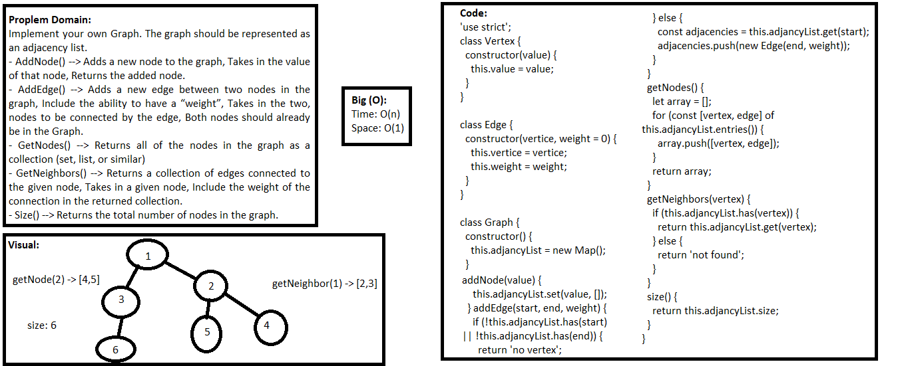
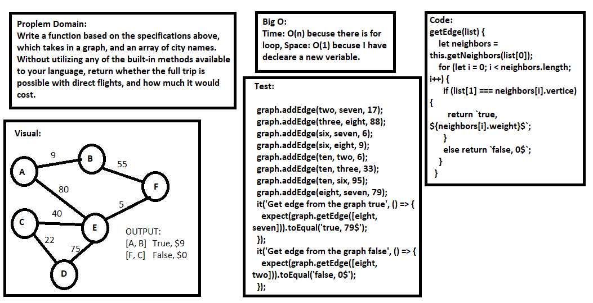

## Graph

### Challenge
- Implement your own Graph. The graph should be represented as an adjacency list.

### Approach & Efficiency
- I used function, for loop, if statements, and while loop.

### API
- AddNode() --> Adds a new node to the graph, Takes in the value of that node, Returns the added node.
- AddEdge() --> Adds a new edge between two nodes in the graph, Include the ability to have a “weight”, Takes in the two, nodes to be connected by the edge, Both nodes should already be in the Graph.
- GetNodes() --> Returns all of the nodes in the graph as a collection (set, list, or similar)
- GetNeighbors() --> Returns a collection of edges connected to the given node, Takes in a given node, Include the weight of the connection in the returned collection.
- Size() --> Returns the total number of nodes in the graph.

### Big O:
**In General:**
Time: O(n), Space: O(1)

Time o(1) for all the method in Graph class except **getNodes** the Time O(n) because it have for loop.
Space O(n) ==> for **addNode()** and **addEdge()** because they take space in memory but the other method o(1) ===> There is additional memory.

### Solution

-----------------------------------------

## Get Edge

### Challenge
- Write a function based on the specifications above, which takes in a graph, and an array of city names. Without utilizing any of the built-in methods available to your language, return whether the full trip is possible with direct flights, and how much it would cost.

### Approach & Efficiency
- I used function, for loop, if statements, and while loop.

### Big O:
**In General:**
getEdge ==> Time: O(n) becuse there is for loop, Space: O(1) becuse I have decleare a new veriable.

### Solution

