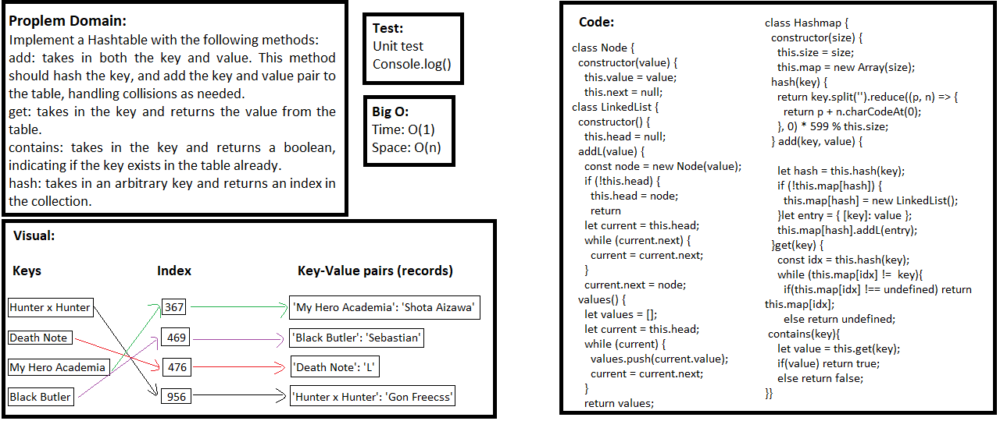

## Hash Table

### Challenge
- Implement a Hashtable with the following methods:
add: takes in both the key and value. This method should hash the key, and add the key and value pair to the table, handling collisions as needed.
get: takes in the key and returns the value from the table.
contains: takes in the key and returns a boolean, indicating if the key exists in the table already.
hash: takes in an arbitrary key and returns an index in the collection.

### Approach & Efficiency
- I used classes, methods for the class, if statements, and while loop.

### API  
- hash: takes in an arbitrary key and returns an index in the collection.
- add: takes in both the key and value. This method should hash the key, and add the key and value pair to the table, handling collisions as needed.
- get: takes in the key and returns the value from the table.
- contains: takes in the key and returns a boolean, indicating if the key exists in the table already.

### Big O:
**In General:**
Time: O(1), Space: O(n)

- **add**, Time: O(1), Space: O(n)
- **get**, Time: O(1), Space: O(n)
- **contains**, Time: O(1), Space: O(1)

### Solution

