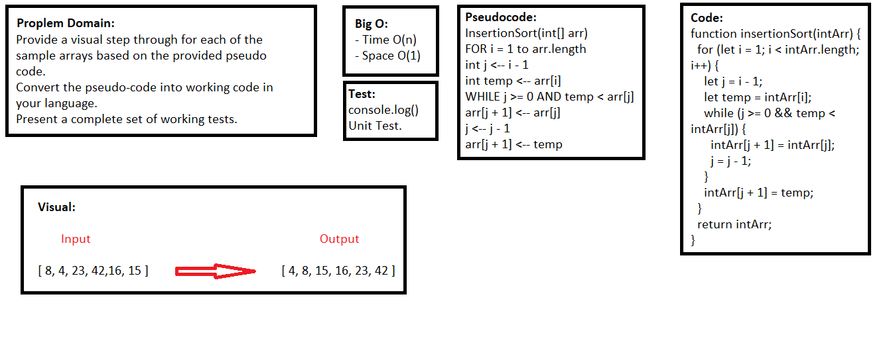
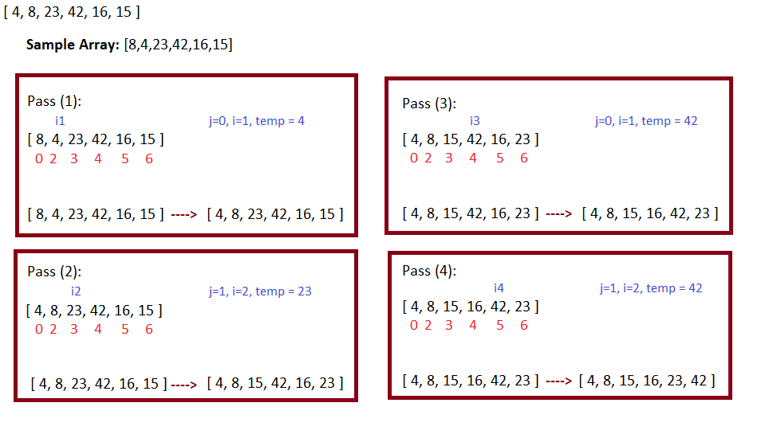

## Insertion Sort

### Challenge
- Provide a visual step through for each of the sample arrays based on the provided pseudo code.
- Convert the pseudo-code into working code in your language.
- Present a complete set of working tests.

### Approach & Efficiency
- I used function, if statement, and for loop.


### Big O (Efficency):

> `- Time O(n)`

> `- Space O(1)`

- Time: O(n^2) ---> The basic operation of this algorithm is comparison. This will happen n * (n-1) number of times…concluding the algorithm to be n squared.

- Space: O(1) ---> No additional space is being created. This array is being sorted in place…keeping the space at constant O(1).

### Pseudocode

```javascript
 InsertionSort(int[] arr)
  
    FOR i = 1 to arr.length
    
      int j <-- i - 1
      int temp <-- arr[i]
      
      WHILE j >= 0 AND temp < arr[j]
        arr[j + 1] <-- arr[j]
        j <-- j - 1
        
      arr[j + 1] <-- temp
```

### Code

```javascript
function insertionSort(intArr) {
  for (let i = 1; i < intArr.length; i++) {
    let j = i - 1;
    let temp = intArr[i];
    while (j >= 0 && temp < intArr[j]) {
      intArr[j + 1] = intArr[j];
      j = j - 1;
    }
    intArr[j + 1] = temp;
  }
  return intArr;
}
```

### Test

```javascript
describe('Insertion Sort', () => {
  it('insertionSort() is return sorted array', () => {
    expect(insertionSort([8, 4, 23, 42, 16, 15])).toEqual([4, 8, 15, 16, 23, 42]);
    expect(insertionSort([20, 18, 12, 8, 5, -2])).toEqual([-2, 5, 8, 12, 18, 20]);
    expect(insertionSort([5, 12, 7, 5, 5, 7])).toEqual([5, 5, 5, 7, 7, 12]);
    expect(insertionSort([2, 3, 5, 7, 13, 11])).toEqual([2, 3, 5, 7, 11, 13]);
  });
});
```

### UML



### Trace

