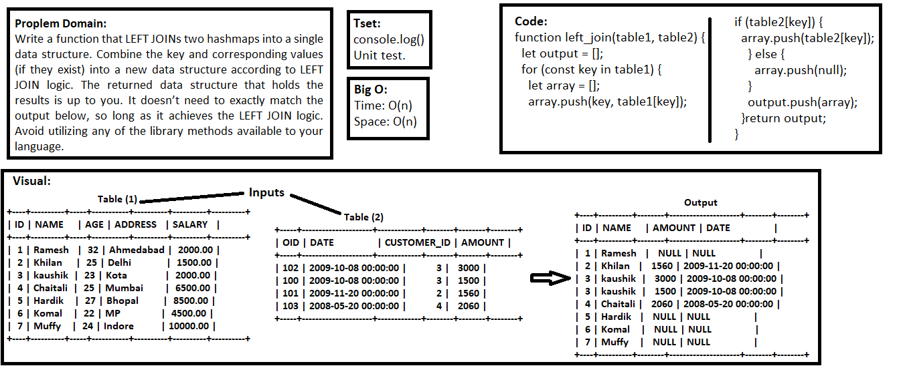

## Left Join

### Challenge
- Write a function that LEFT JOINs two hashmaps into a single data structure. The first parameter is a hashmap that has word strings as keys, and a synonym of the key as values. The second parameter is a hashmap that has word strings as keys, and antonyms of the key as values. Combine the key and corresponding values (if they exist) into a new data structure according to LEFT JOIN logic. LEFT JOIN means all the values in the first hashmap are returned, and if values exist in the “right” hashmap, they are appended to the result row. If no values exist in the right hashmap, then some flavor of NULL should be appended to the result row. The returned data structure that holds the results is up to you. It doesn’t need to exactly match the output below, so long as it achieves the LEFT JOIN logic. Avoid utilizing any of the library methods available to your language.

### Approach & Efficiency
- I used function, for loop `Object`, if statements, and while loop.

### API  
- left_join: function that has the first parameter is a hashmap that has word strings as keys, and a synonym of the key as values. The second parameter is a hashmap that has word strings as keys, and antonyms of the key as values. And it  is retrurn output as a new hashed table.

### Big O:
**In General:**
Time: O(n), Space: O(n)

- **left_join**, Time: O(n) `The function is pass through the tables.` , Space: O(n) `There is additional memory.`

### Solution
