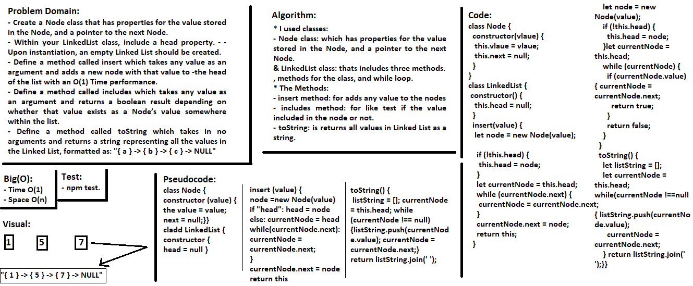

## Singly Linked List
> This code is Node class that has properties for the value stored in the Node, and a pointer to the next Node.

### Challenge
It is a Node class that has properties for the value stored in the Node, and a pointer to the next Node.
Within the LinkedList class, include a head property, and there is a insert method which takes any value as an argument and adds a new node with that value to the head of the list with an O(1) Time performance, there is also a method called includes which takes any value as an argument and returns a boolean result depending on whether that value exists as a Node’s value somewhere within the list, the last method called toString which takes in no arguments and returns a string representing all the values in the Linked List, formatted as: "{ a } -> { b } -> { c } -> NULL"

### Approach & Efficiency
- I used classes, methods for the class, and while loop.

### API  
- Node class: which has properties for the value stored in the Node, and a pointer to the next Node.
- LinkedList class: thats includes three methods.
- insert method: for adds any value to the nodes
- includes method: for like test if the value included in the node or not.
- toString: is returns all values in Linked List as a string. 

### Big O:
- Time O(1)
- Space O(n)

### Solution
