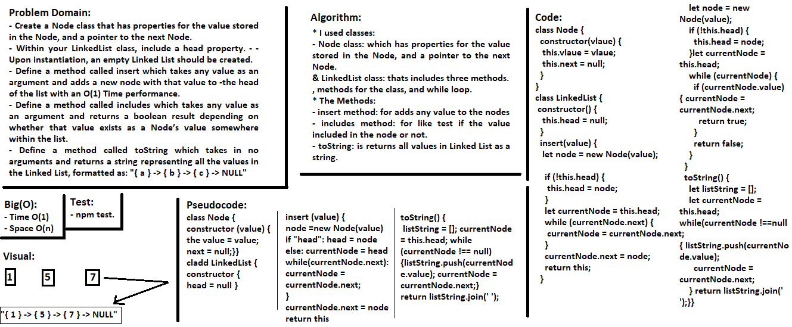
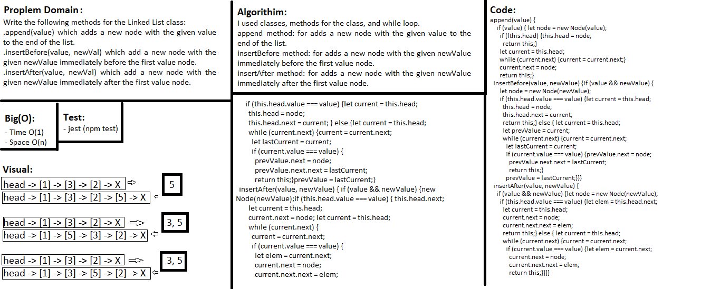
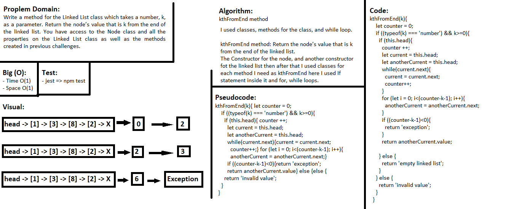

## Singly Linked List
> This code is Node class that has properties for the value stored in the Node, and a pointer to the next Node.

### Challenge
It is a Node class that has properties for the value stored in the Node, and a pointer to the next Node.
Within the LinkedList class, include a head property, and there is a insert method which takes any value as an argument and adds a new node with that value to the head of the list with an O(1) Time performance, there is also a method called includes which takes any value as an argument and returns a boolean result depending on whether that value exists as a Node’s value somewhere within the list, the last method called toString which takes in no arguments and returns a string representing all the values in the Linked List, formatted as: "{ a } -> { b } -> { c } -> NULL"

### Approach & Efficiency
- I used classes, methods for the class, and while loop.

### API  
- Node class: which has properties for the value stored in the Node, and a pointer to the next Node.
- LinkedList class: thats includes three methods.
- insert method: for adds any value to the nodes
- includes method: for like test if the value included in the node or not.
- toString method: is returns all values in Linked List as a string. 

### Big O:
- Time O(1)
- Space O(1)

### Solution

---

## Linked list Insertions
> This code is Node class that has properties for the value insert after or before specific value or append new value in the end in the Node, and a pointer to the next Node.

### Challenge
Write the following methods for the Linked List class:
.append(value) which adds a new node with the given value to the end of the list
.insertBefore(value, newVal) which add a new node with the given newValue immediately before the first value node
.insertAfter(value, newVal) which add a new node with the given newValue immediately after the first value node

### Approach & Efficiency
- I used classes, methods for the class, and while loop.

### API  
- append method: for adds a new node with the given value to the end of the list.
- insertBefore method: for adds a new node with the given newValue immediately before the first value node.
- insertAfter method: for adds a new node with the given newValue immediately after the first value node. 

### Big O:
- Time O(1)
- Space O(1)

### Solution

---

## Linked list k-th value
> This code is Node class that has properties for the value that return the node’s value that is k from the end of the linked list.

### Challenge
Write a method for the Linked List class which takes a number, k, as a parameter. Return the node’s value that is k from the end of the linked list. You have access to the Node class and all the properties on the Linked List class as well as the methods created in previous challenges.

### Approach & Efficiency
- I used classes, methods for the class, and while loop.

### API  
- kthFromEnd method: Return the node’s value that is k from the end of the linked list.

### Big O:
- Time O(1)
- Space O(1)

### Solution
