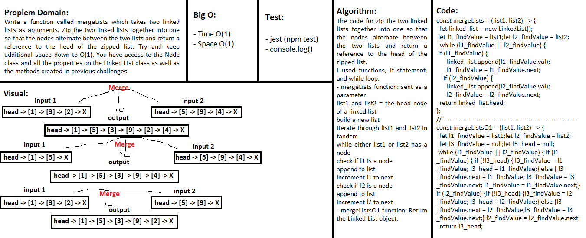

## Linked list Merge two linked lists
> This code is Node class that has properties for zip the two linked lists together into one so that the nodes alternate between the two lists and return a reference to the head of the zipped list.

### Challenge
Write a function called mergeLists which takes two linked lists as arguments. Zip the two linked lists together into one so that the nodes alternate between the two lists and return a reference to the head of the zipped list. Try and keep additional space down to O(1). You have access to the Node class and all the properties on the Linked List class as well as the methods created in previous challenges.

### Approach & Efficiency
- I used functions, if statement, and while loop.

### API  
- mergeLists function: Build a new list then iterate through list1 and list2 in tandem.
- mergeListsO1 function: Return the Linked List object.

### Big O:
- Time O(1)
- Space O(1)

### Solution
