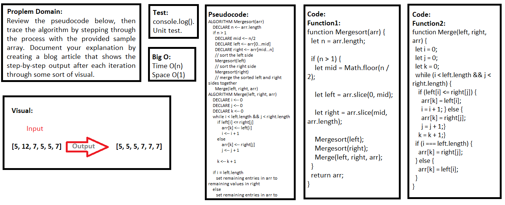
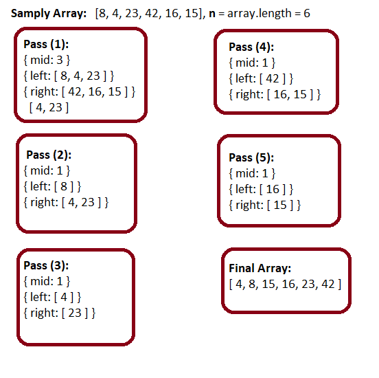

## Merge Sort

### Challenge
- Review the pseudocode below, then trace the algorithm by stepping through the process with the provided sample array. Document your explanation by creating a blog article that shows the step-by-step output after each iteration through some sort of visual.

### Approach & Efficiency
- I used function, if statement, and for loop.


### Big O (Efficency):

> `- Time O(n)`

> `- Space O(1)`

- Time: O(n^2) ---> The basic operation of this algorithm is comparison. This will happen n * (n-1) number of times…concluding the algorithm to be n squared.

- Space: O(1) ---> No additional space is being created.

### Pseudocode

```javascript
ALGORITHM Mergesort(arr)
    DECLARE n <-- arr.length
           
    if n > 1
      DECLARE mid <-- n/2
      DECLARE left <-- arr[0...mid]
      DECLARE right <-- arr[mid...n]
      // sort the left side
      Mergesort(left)
      // sort the right side
      Mergesort(right)
      // merge the sorted left and right sides together
      Merge(left, right, arr)

ALGORITHM Merge(left, right, arr)
    DECLARE i <-- 0
    DECLARE j <-- 0
    DECLARE k <-- 0

    while i < left.length && j < right.length
        if left[i] <= right[j]
            arr[k] <-- left[i]
            i <-- i + 1
        else
            arr[k] <-- right[j]
            j <-- j + 1
            
        k <-- k + 1

    if i = left.length
       set remaining entries in arr to remaining values in right
    else
       set remaining entries in arr to remaining values in left
```

### Code

```javascript
function Mergesort(arr) {
  let n = arr.length;

  if (n > 1) {
    let mid = Math.floor(n / 2);
    
    let left = arr.slice(0, mid);
    
    let right = arr.slice(mid, arr.length);
    
    Mergesort(left);    
    Mergesort(right);
    Merge(left, right, arr);
  }
  return arr;
}

function Merge(left, right, arr) {
  let i = 0;
  let j = 0;
  let k = 0;

  while (i < left.length && j < right.length) {
    if (left[i] <= right[j]) {
      arr[k] = left[i];
      i = i + 1;
    } else {
      arr[k] = right[j];
      j = j + 1;
    }
    k = k + 1;
  }

  if (i === left.length) {
    arr[k] = right[j];
  } else {
    arr[k] = left[i];
  }
}
```

### Test

```javascript
describe('Merge Sort', () => {
  it('mergeSort() is return merged array', () => {
    expect(mergeSort([8, 4, 23, 42, 16, 15])).toEqual([4, 8, 15, 16, 23, 42]);
    expect(mergeSort([20, 18, 12, 8, 5, -2])).toEqual([-2, 5, 8, 12, 5, -2]);
    expect(mergeSort([5, 12, 7, 5, 5, 7])).toEqual([5, 5, 5, 7, 7, 7]);
    expect(mergeSort([2, 3, 5, 7, 13, 11])).toEqual([2, 3, 5, 7, 13, 11]);
  });
});
```

### UML



### Trace

