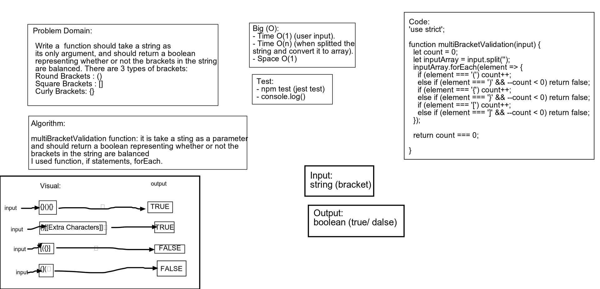

## Multi-bracket Validation
> This code is a function should take a string as its only argument, and should return a boolean.

### Challenge
Write a  function should take a string as its only argument, and should return a boolean representing whether or not the brackets in the string are balanced. There are 3 types of brackets:
Round Brackets : ()
Square Brackets : []
Curly Brackets : {}

### Approach & Efficiency
- I used function, if statements, forEach.

### API  
- multiBracketValidation function: it is take a sting as a parameter and return a boolean if the brakets is a balanced.

### Big O:
- Time O(1) (user input).
- Time O(n) (when splitted the string and convert it to array).
- Space O(1)

### Solution
