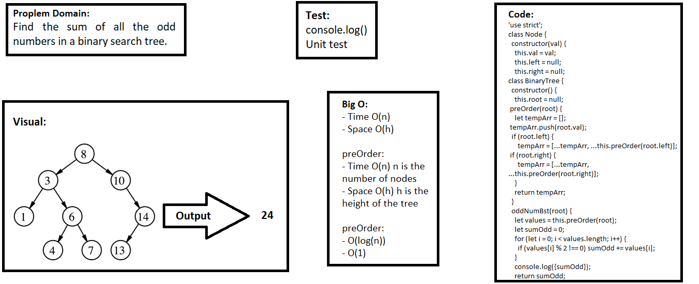

## Odd Number BTS
> This code is Node class that has properties for the value stored in the node, the left child node, and the right child node.

### Challenge
Find the sum of all the odd numbers in a binary search tree. 

### Approach & Efficiency
- I used classes, if statement, and methods.

### API  
- preOrder: which returns an array of the values, ordered appropriately.
- oddNumBst: which return thesum of all the odd numbers in a binary search tree.

### Big O:

> `- Time O(n)`

> `- Space O(h)`

**preOrder:**
- Time O(n) n is the number of nodes
- Space O(h) h is the height of the tree

**preOrder:**
- O(log(n))
- O(1)

### Solution

