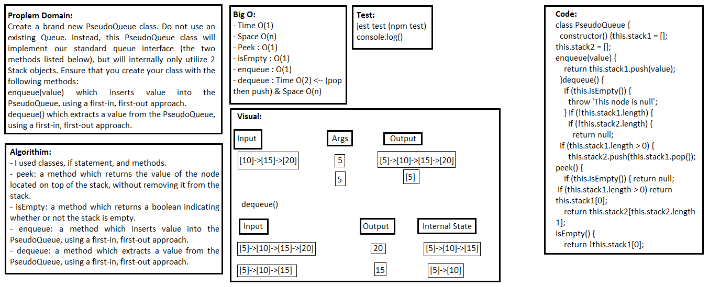

## Linked list Merge two linked lists
> This code is PseudoQueue class that has methods wich inserts value into the PseudoQueue, using a first-in, first-out approach & extracts a value from the PseudoQueue, using a first-in, first-out approach.

### Challenge
Create a brand new PseudoQueue class. Do not use an existing Queue. Instead, this PseudoQueue class will implement our standard queue interface (the two methods listed below), but will internally only utilize 2 Stack objects. Ensure that you create your class with the following methods:
enqueue(value) which inserts value into the PseudoQueue, using a first-in, first-out approach.
dequeue() which extracts a value from the PseudoQueue, using a first-in, first-out approach. 

### Approach & Efficiency
- I used classes, if statement, and methods.

### API  
- peek: a method which returns the value of the node located on top of the stack, without removing it from the stack.
- isEmpty: a method which returns a boolean indicating whether or not the stack is empty.
- enqueue: a method which inserts value into the PseudoQueue, using a first-in, first-out approach.
- dequeue: a method which extracts a value from the PseudoQueue, using a first-in, first-out approach.

### Big O:

> `- Time O(1)`

> `- Space O(n)`

> - Peek : O(1)

> - isEmpty : O(1)

> - enqueue : O(1)

> - dequeue : Time O(2) <-- (pop then push) & Space O(n)

### Solution

