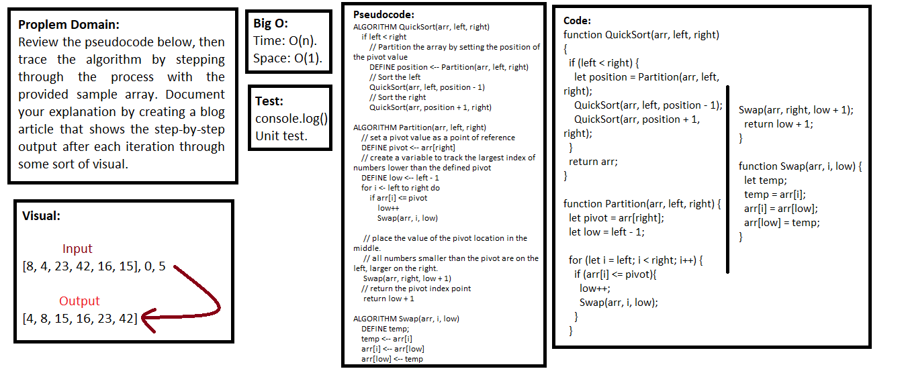
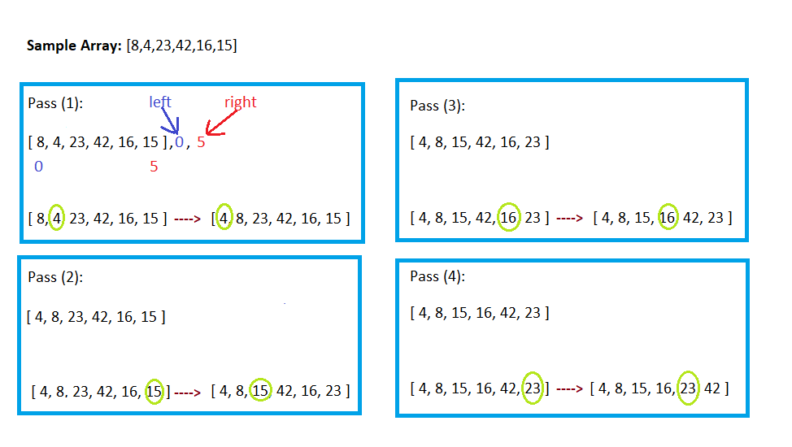

## Quick Sort

### Challenge
- Review the pseudocode below, then trace the algorithm by stepping through the process with the provided sample array. Document your explanation by creating a blog article that shows the step-by-step output after each iteration through some sort of visual.

### Approach & Efficiency
- I used function, if statement, and for loop.


### Big O (Efficency):

> `- Time O(n)`

> `- Space O(1)`

- Time: O(n^2) ---> The basic operation of this algorithm is comparison. This will happen n * (n-1) number of times…concluding the algorithm to be n squared.

- Space: O(1) ---> No additional space is being created.

### Pseudocode

```javascript
ALGORITHM QuickSort(arr, left, right)
    if left < right
        // Partition the array by setting the position of the pivot value 
        DEFINE position <-- Partition(arr, left, right)
        // Sort the left
        QuickSort(arr, left, position - 1)
        // Sort the right
        QuickSort(arr, position + 1, right)

ALGORITHM Partition(arr, left, right)
    // set a pivot value as a point of reference
    DEFINE pivot <-- arr[right]
    // create a variable to track the largest index of numbers lower than the defined pivot
    DEFINE low <-- left - 1
    for i <- left to right do
        if arr[i] <= pivot
            low++
            Swap(arr, i, low)

     // place the value of the pivot location in the middle.
     // all numbers smaller than the pivot are on the left, larger on the right. 
     Swap(arr, right, low + 1)
    // return the pivot index point
     return low + 1

ALGORITHM Swap(arr, i, low)
    DEFINE temp;
    temp <-- arr[i]
    arr[i] <-- arr[low]
    arr[low] <-- temp
```

### Code

```javascript
function QuickSort(arr, left, right) {
  if (left < right) {
    let position = Partition(arr, left, right);
    QuickSort(arr, left, position - 1);
    QuickSort(arr, position + 1, right);
  }
  return arr;
}

function Partition(arr, left, right) {
  let pivot = arr[right];
  let low = left - 1;

  for (let i = left; i < right; i++) {
    if (arr[i] <= pivot){
      low++;
      Swap(arr, i, low);
    }
  }
  Swap(arr, right, low + 1);
  return low + 1;
}

function Swap(arr, i, low) {
  let temp;
  temp = arr[i];
  arr[i] = arr[low];
  arr[low] = temp;
}
```

### Test

```javascript
describe('Quick Sort', () => {
  it('quickSort() is return sorted array', () => {
    expect(quickSort([8, 4, 23, 42, 16, 15], 0, 5)).toEqual([4, 8, 15, 16, 23, 42]);
    expect(quickSort([5, 12, 7, 5, 5, 7, 9], 0, 6)).toEqual([5, 5, 5, 7, 7, 9, 12]);
    expect(quickSort([2, 3, 5, 7, 13, 11, 7, -3], 0, 7)).toEqual([-3, 2, 3, 5, 7, 7, 11, 13]);
  });
});
```

### UML



### Trace

