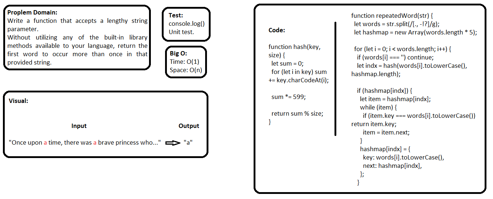

## Repeated Words

### Challenge
- Write a function that accepts a lengthy string parameter.
Without utilizing any of the built-in library methods available to your language, return the first word to occur more than once in that provided string.

### Approach & Efficiency
- I used function, for loop, if statements, and while loop.

### API  
- repeatedWord: function that accepts a lengthy string parameter, it return the first word to occur more than once in that provided string.

### Big O:
**In General:**
Time: O(1), Space: O(n)

- **repeatedWord**, Time: O(1), Space: O(n)

### Solution

