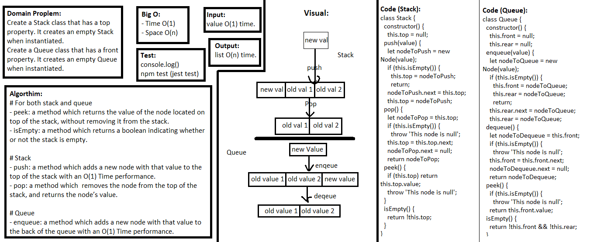

## Linked list Merge two linked lists
> This code is Node class that has properties for the value stored in the Node, and a pointer to the next node.

### Challenge
Create a Stack class that has a top property. It creates an empty Stack when instantiated.
Create a Queue class that has a front property. It creates an empty Queue when instantiated.

### Approach & Efficiency
- I used classes, if statement, and methods.

### API  

##### For both stack and queue
- peek: a method which returns the value of the node located on top of the stack, without removing it from the stack.
- isEmpty: a method which returns a boolean indicating whether or not the stack is empty.

#### Stack
- push: a method which adds a new node with that value to the top of the stack with an O(1) Time performance.
- pop: a method which  removes the node from the top of the stack, and returns the node’s value.

#### Queue
- enqueue: a method which adds a new node with that value to the back of the queue with an O(1) Time performance.
- dequeue: a method which removes the node from the front of the queue, and returns the node’s value.

### Big O:

> `- Time O(1)`

> `- Space O(n)`

**For both stack and queue**
> - Peek : O(1)

> - isEmpty : O(1)

**Stack**
> - push: O(1)

> - pop: O(1)

**Queue**
> - enqueue : O(1)

> - dequeue : O(1)

### Solution

