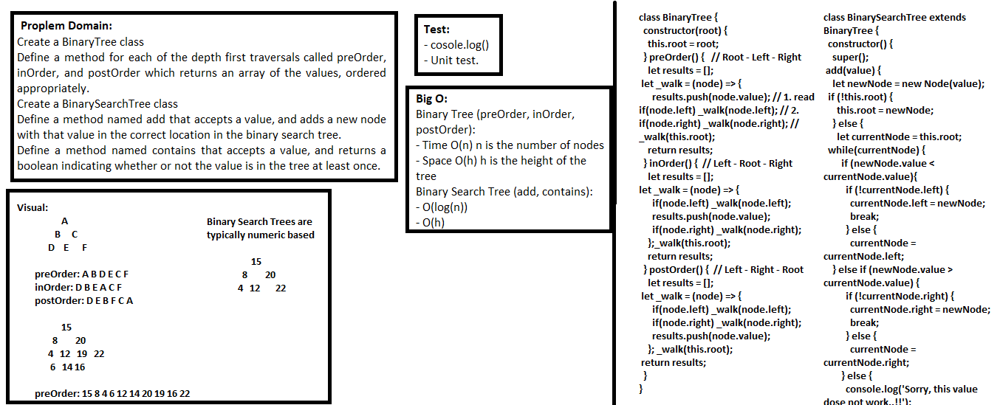

## Linked list Merge two linked lists
> This code is Node class that has properties for the value stored in the node, the left child node, and the right child node.

### Challenge
Create a BinaryTree class
Define a method for each of the depth first traversals called preOrder, inOrder, and postOrder which returns an array of the values, ordered appropriately.
Create a BinarySearchTree class
Define a method named add that accepts a value, and adds a new node with that value in the correct location in the binary search tree.
Define a method named contains that accepts a value, and returns a boolean indicating whether or not the value is in the tree at least once. 

### Approach & Efficiency
- I used classes, if statement, while loop, and methods.

### API  
- preOrder, inOrder, postOrder: which returns an array of the values, ordered appropriately.
- add: a method which accepts a value, and adds a new node with that value in the correct location in the binary search tree.
- contains: accepts a value, and returns a boolean indicating whether or not the value is in the tree at least once. 

### Big O:

> `- Time O(n)`

> `- Space O(h)`

**Binary Tree -** (preOrder, inOrder, postOrder):
- Time O(n) n is the number of nodes
- Space O(h) h is the height of the tree

**Binary Search Tree -** (add, contains):
- O(log(n))
- O(h)

### Solution

