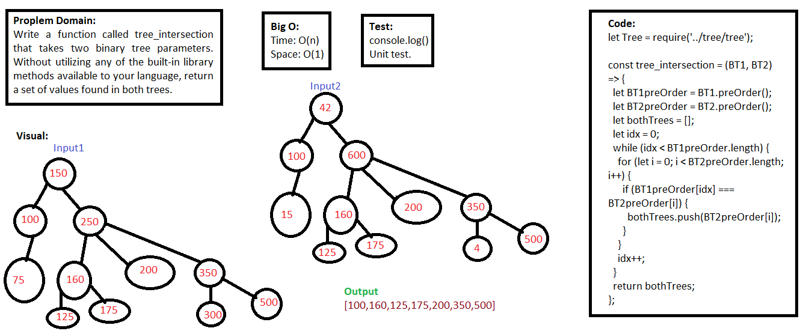

## Tree Intersection

### Challenge
- Write a function called tree_intersection that takes two binary tree parameters. Without utilizing any of the built-in library methods available to your language, return a set of values found in both trees.

### Approach & Efficiency
- I used function, for loop, if statements, and while loop.

### API  
- tree_intersection: function that return a set of values found in both trees.

### Big O:
**In General:**
Time: O(n), Space: O(1)

- **tree_intersection**, Time: O(n) `The function is pass through the trees.` , Space: O(1) `There is no new memory.`

### Solution
